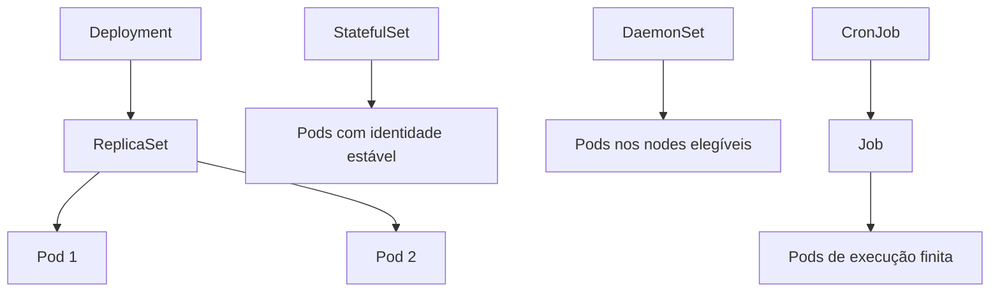

# Quem gerencia os Pods?

```mermaid
flowchart TB
    D[Deployment] --> RS[ReplicaSet]
    RS --> P1[Pod 1]
    RS --> P2[Pod 2]
    ST[StatefulSet] --> PS[Pods com identidade estável]
    DS[DaemonSet] --> PD[Pods nos nodes elegíveis]
    CJ[CronJob] --> J[Job]
    J --> PJ[Pods de execução finita]
```

Diagramas didáticos; scheduling e kubelet realizam funções adicionais.
