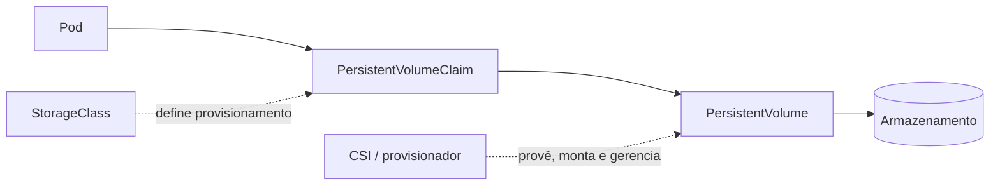

# Pedido e provisão de armazenamento

```mermaid
flowchart LR
    POD[Pod] --> PVC[PersistentVolumeClaim]
    SC[StorageClass] -. define provisionamento .-> PVC
    PVC --> PV[PersistentVolume]
    CSI[CSI / provisionador] -. provê, monta e gerencia .-> PV
    PV --> BACKEND[(Armazenamento)]
```

Um cluster pode não ter provisionador dinâmico. `PVC Pending` nem sempre indica defeito: observe `WaitForFirstConsumer`.
