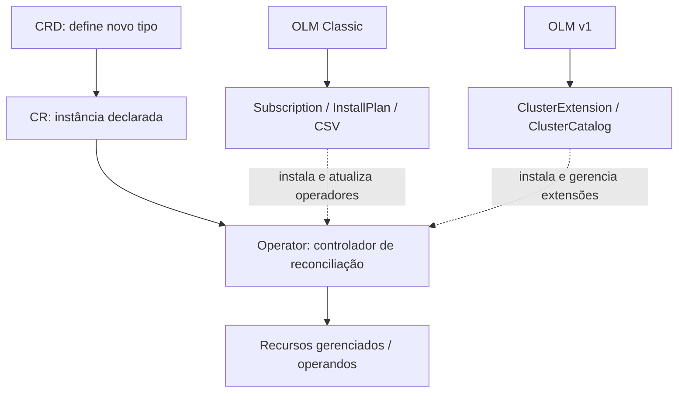

# Padrão Operator e as famílias OLM

```mermaid
flowchart TB
    CRD[CRD: define novo tipo] --> CR[CR: instância declarada]
    CR --> OP[Operator: controlador de reconciliação]
    OP --> P[Recursos gerenciados / operandos]
    C[OLM Classic] --> SUB[Subscription / InstallPlan / CSV]
    V[OLM v1] --> CE[ClusterExtension / ClusterCatalog]
    SUB -. instala e atualiza operadores .-> OP
    CE -. instala e gerencia extensões .-> OP
```

`ClusterOperator` apresenta status de componentes centrais do OpenShift e não deve ser confundido com qualquer operador instalado via OLM.
